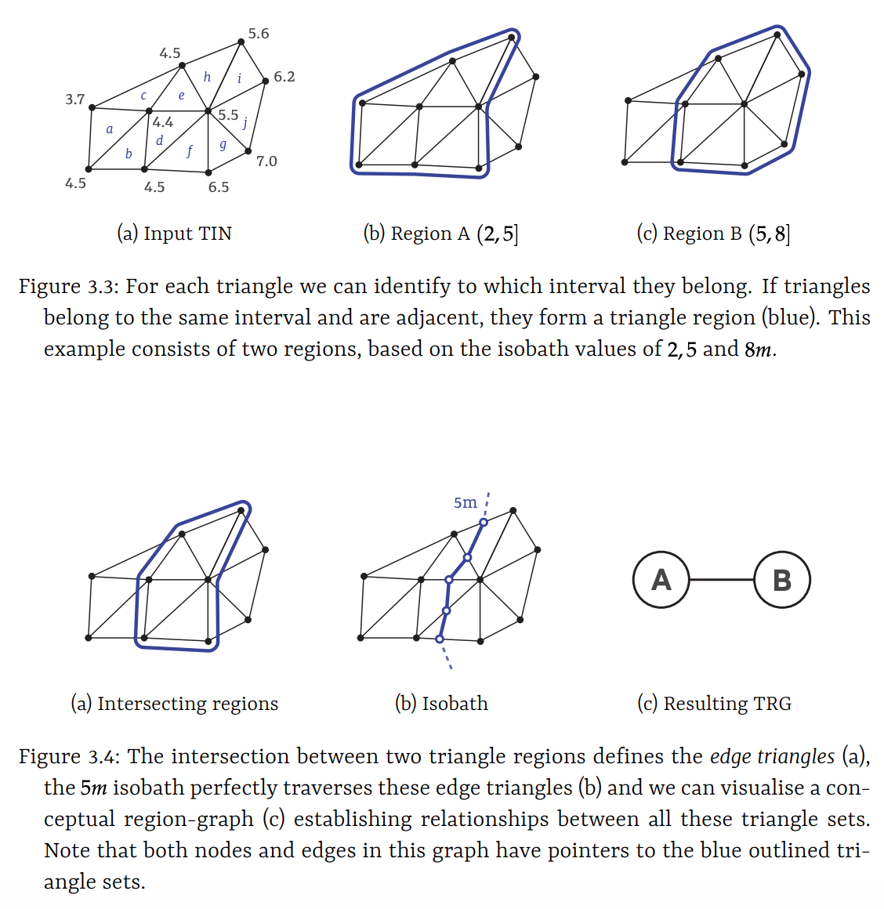
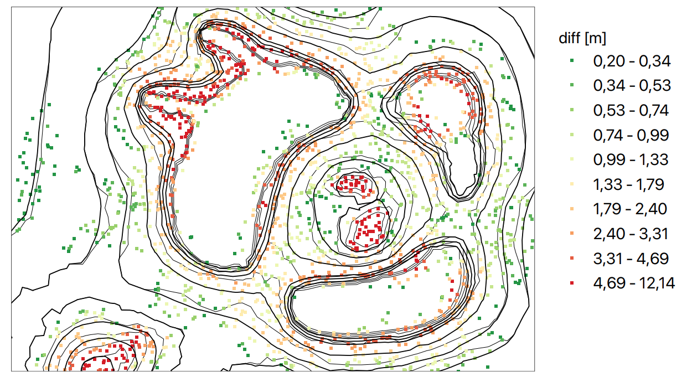
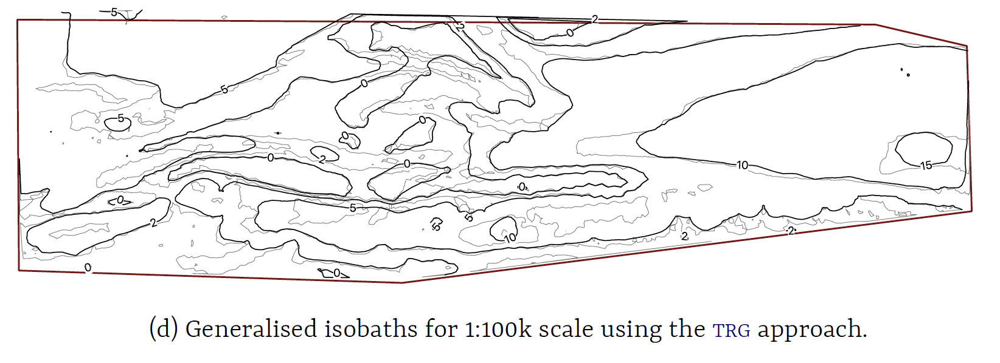
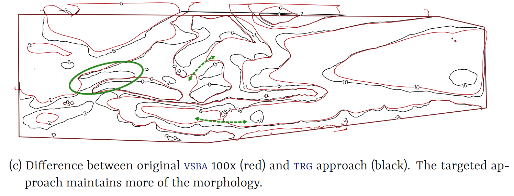

## Automatic isobath generalisation using the *Triangle Region Graph*: uniting soundings, isobath and constraints through a navigational surface

## Rule-based isobath generalisation using th

### Authors

*Willem van Opstal, Martijn Meijers, Ravi Peters*

### Keywords

nautical chart, contours, isobaths, generalisation, TIN, navigational surface

### Abstract

Navigational charts play a vital role in a ship's safety while navigating the seas, rivers or lakes. With most of the features and obstructions being out of sight -below sea-level - these charts are more critical than e.g. topographic maps. For routing but also positioning, depth information is a key aspect on these charts. This depth information is available in either depth contours, coloured depth areas or individual spot soundings. However with the data originating from accurate but usually erratic survey data, a visualisation of raw data is not sufficient for use in a navigational chart directly. It would not clearly convey the information to a human operator in one sight, and thus this visualisation is in need of generalisation: a simplified and hopefully more useful representation of the same data.  
In navigational isobath generalisation four main generalisation constraints can be distinguished: legibility, morphology, functional and topological. Isobaths should always be topological valid and *safe* (hard constraints). Generalised isobaths may never indicate an area being deeper than it was actually measured in the first place, and thus can only be moved to their deeper side. The objective of yielding a legible and useful chart concretely means having smooth and distinguishable lines. Irrelevant details (isolated pits) should be omitted and dangerous obstacles (isolated shoals) can be emphasised. Yielding a legible isobath representation is in constant compromise with the constraint of representing morphology as good as possible. Every operation increasing legibility of the chart lead to a reduced representation of the actual morphology (and with it a reduction of navigable space). This ever going compromise is what makes navigational isobath generalisation such a complex task. Choices are different for different chart scales, chart purposes and even different areas within each chart (e.g. fairways, anchorages, nature reserves require different amounts and types of generalisation).

We can differentiate existing generalisation methods (specifically for navigational purposes) in two categories. A line-based approach extracts (safe) isobaths first and processes only those. Surface-based approaches generalises an intermediate (navigational) surface and later extract isobaths from the generalised surface. Both approaches have their advantages and disadvantages. State-of-the-art line-based approaches (Guilbert, 2016) intelligently steer operators based on conflicting constraints on the isobath-level. However it needs already safely extracted isobaths as an input, only handles (complex) splines and there is no connection anymore with the underlying survey data. State-of-the-art surface-based approaches (e.g. Peters, 2014) alter a triangulated 2.5D terrain. By moving it only upwards safety is guaranteed and topological errors are minimised through the 2.5D representation. Generalisation is performed through smoothing. Since there is a direct link with the survey data these methods can theoretically also account for survey data like accuracy, lineage and spatial distribution. However it lacks a connection with the final cartographic product; there are no means of identifying conflicting constraints on the isobath-level and thus is not able to intelligently steer operators to where they are actually needed. Implication of this defect is that generalisation is applied globally and thus sometimes is applied where it is not needed anymore: effectively giving up some of the navigable space.  
The goal of this research is extending the surface-based approach with the ability of steering generalisation operators locally, so we can maintain more of the actual morphology if possible. For this purpose we should be able to identify conflicting areas based on the cartographic product (the discrete terrain representation with isobaths only) and lead them back to the TIN so we can apply the generalisation operators. Ideally this would lead to an integrated approach, in which we can use all information available in the generalisation pipeline: from survey data to cartographic constraints.

We achieve a linking mechanism between the triangulation and isobaths through what we call the *triangle region graph* (TRG). Inspired by the triangle interval tree (Kreveld, 1996) and inter-contour (region) graph (Guilbert, 2012), this structure subdivides sets of triangles based on their vertical values (Figure 1). Sets of adjacent triangles falling in the same vertical interval between two isobath values of choice (e.g. 2m and 5m) form one inter-contour *region* (a node). Two intersecting regions are adjacent through an edge in the region graph. An edge in the graph also points to a set of triangles: *the edge triangles*. An edge always contains an isobath, and each isobath always follows a set of edge triangles (Figure 2). In theory, we thus have an approximation of each isobath without actually extracting it. Moreover, isobaths are always *safe*, also in the case of a horizontal terrace on a sloping hill: only the deeper side of the terrace-isobath is extracted.  
By using this structure, and pointing to individual TIN faces from both nodes and edges, we know for each isobath and inter-isobath area which TIN faces and vertices account for the feature of interest. We directly establish adjacency relations between all isobaths, and know through which part of the triangulation they are adjacent. The full structure is directly generated from the TIN alone. However, it does not yet fully classify undersea features (e.g. peaks or pits) since containment relationships are not captured in the region graph.

The generalisation process makes use of the now available linking mechanism between isobaths and soundings, and also the isobaths with each other. We continuously maintain this linking mechanism through our conceptual surface (grey outline) consisting of a Delaunay triangulation structured by the TRG (Figure 3). The surface and linked isobaths are evaluated with objective legibility requirements. We can for example evaluate smoothness of a single isobath, distance between two adjacent isobaths (slope), distance between two shallows (narrow saddles), irrelevant deeper indents on a single isobath (gullies), but also size of small peaks or pits. All of the required information is available in the conceptual surface. Such a conflict always leads back to either (part of) an isobath, (part of) an inter-contour region or individual areas or soundings. Once a conflict is identified, we can efficiently retrieve the part of the triangulation (either faces or vertices) affecting this conflict.  
Now on this isolated part of the triangulation, we can apply our generalisation operator directly on the navigational surface, locally. The main operator is smoothing using the Laplace interpolant and it effectively smoothens isobaths, removes small pits, enlarges small peaks and is capable of aggregation in some cases. The operator applies on individual vertices. For more aggressive generalisation we can also move vertices (upwards!) to a fixed vertical value (e.g. in aggregation of peaks). This process of identification, isolation, application is repeated until some set of minimum legibility requirements are met, and only then the final isobaths are extracted. It is assumed that with only applying it locally, morphology is represented as good as possible. Of course, these minimum requirements are dependent upon scale and purpose of the chart.

The TRG data structure and generalisation process is implemented as a proof of concept and applied on both synthetic and real-world datasets. For now, the evaluation model is simply rule-based and each iteration the entire dataset is evaluated. Taking different thresholds on the legibility requirements we can adapt the process of conflict isolation to the scale and purpose of the chart. Larger thresholds lead to more generalisation, usually needed in smaller scale charts. Figure 5 shows such a result with only soundings (x,y,z) and isobath-values (0, 2, 5, 10m) as input for a 1:100k chart. Besides smoothing, also densification of the TIN (insertion of new vertices) was applied to overcome the discretisation error on line extraction; effectively yielding more smoothened lines.  
With our new targeted approach and local smoothing operators more of the morphology is maintained, while still yielding a finely legible chart (Figure 6). In comparison with a non-targeted approach more of the navigable space is preserved which can for example be critical in anchorages or fairways (green pointers). Especially at large scale, detailed charts, the results are promising: we can tune parameters and really steer the process on where to apply more generalisation or not. Figure 4 shows the effect of targeted generalisation: more generalisation (vertical shift) is applied around areas which needed it, irrelevant areas (no isobaths nearby) are left original. For smaller scales the challenge now is to generalise beyond smoothness. More radical operators are needed to omit all irrelevant details, emphasise dangerous obstacles or aggregate shallows more naturally. On the other side, it would also benefit from more complex metrics assessing the legibility more effectively.

The overall framework of using the triangle region graph as a linking mechanism between soundings, triangulation and isobaths has potential for a truly automated generalisation approach. It is able to account for information throughout the generalisation pipeline: from survey data to cartographic constraints and makes use of the advantages of both existing approaches. In the future it can benefit from incorporating more intelligence: more complex metrics and operators, better use of the available information in the region graph, other evaluation models like optimisation and possibly a connection to line-based generalisation/simplification afterwards.

  
**Figure 1** Geometry of the TRG. Regions are resembled as nodes, overlapping regions form edges. An isobath always follows such a set of *edge triangles*.

  
**Figure 2** TRG example, visualising overlapping triangle regions (a), edge triangles with their isobaths (b), inter-contour graph based on adjacency (c) and IHO depth information in the form of both isobaths and depth areas (d).

  
**Figure 3** Generalisation process.

  
**Figure 4** The vertical shift in each vertex after generalisation. Note that generalisation is only applied around isobaths (only there conflicts are possible), and more extreme generalisation took place where conflicts were significant (steep, narrow or erratic).

  
**Figure 5** Originally extracted isobaths from TIN (grey) and the generalised isobaths for a scale of 1:100k (black).

  
**Figure 6** Comparison between non-local and local (targeted) generalisation. In our new approach with conflict isolation and local operators we maintain more of the actual morphology (increased navigable areas), while still yielding a finely legible chart.

### References

Guilbert, E. (2016). Feature‐Driven Generalization of Isobaths on Nautical Charts: A Multi‐Agent System Approach. Trans. in GIS, 20:126-143. doi:[10.1111/tgis.12147](https://doi.org/10.1111/tgis.12147)

Peters, R., Ledoux, H., Meijers, M. (2014). A Voronoi-based approach to generating depth-contours for hydrographic charts. Marine Geodesy, 37(2):145–166. doi:[10.1080/01490419.2014.902882](https://doi.org/10.1080/01490419.2014.902882)

van Kreveld, M. (1996). Efficient methods for isoline extraction from a TIN. International journal of geographical information systems, 10(5):523–540. doi:[10.1080/02693799608902095](https://doi.org/10.1080/02693799608902095)

Guilbert, E. (2012). Multi-level representation of terrain features on a contour map. GeoInformatica, 17(2):301–324. doi:[10.1007/s10707-012-0153-z](https://doi.org/10.1007/s10707-012-0153-z)

Van Opstal, W. (2020). Automatic isobath generalisation for navigational charts. Master's thesis, Geomatics. Delft University of Technology, pp. 145. access:[link](http://resolver.tudelft.nl/uuid:2e95de28-c9ce-4d07-8131-ae3c4c5b9d86)
