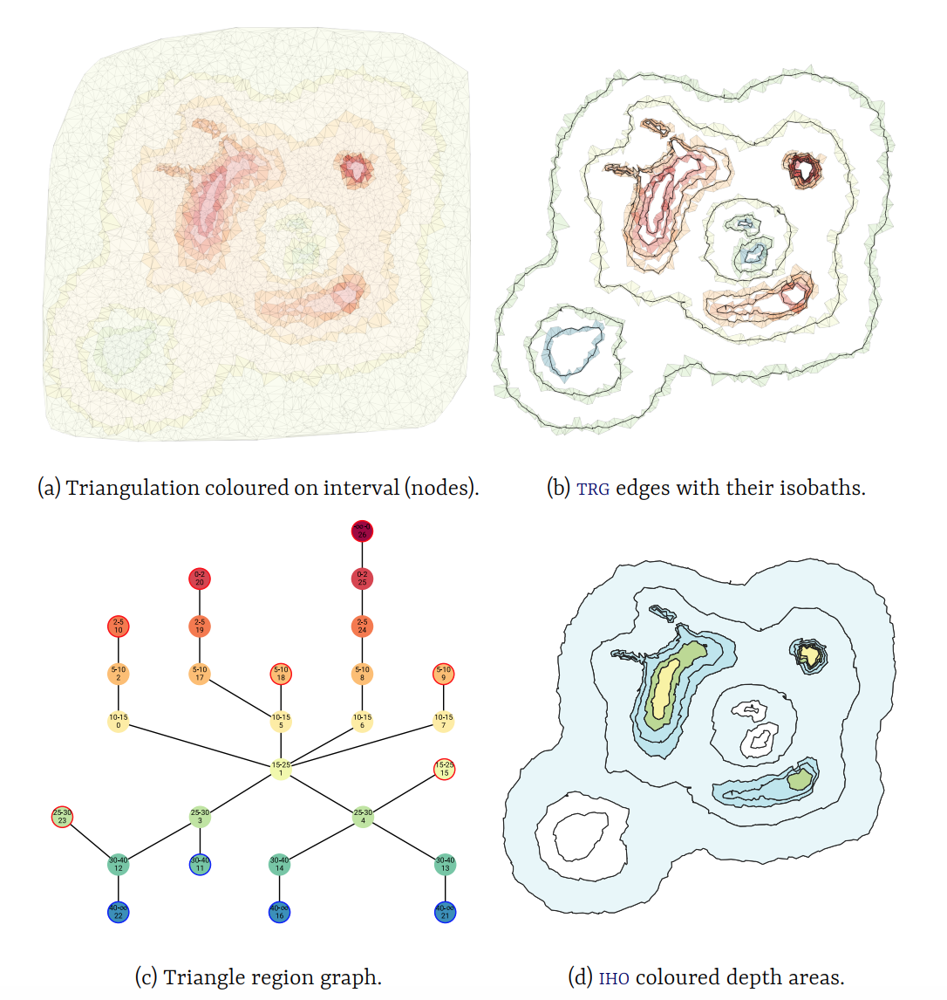
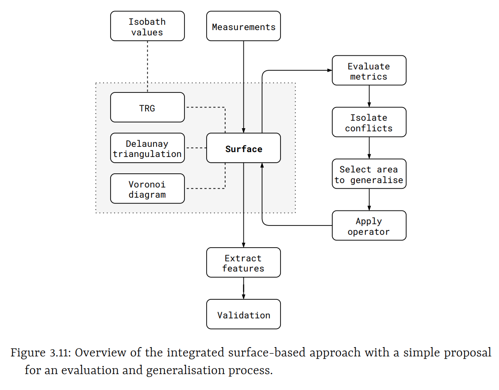

## Automatic isobath generalisation using the *Triangle Region Graph*: uniting soundings and isobath through a navigational surface

### Authors

*Willem van Opstal, Martijn Meijers, Ravi Peters*

### Keywords

nautical chart, generalisation, isobaths, TIN, navigational surface

### Abstract

-------
+ Short introduction on navigational charts
+ why they are critical (compared to topographic maps)
+ why generalisation is important in these charts
+ the four constraints (context)  

Navigational charts play a vital role in a ship's safety while navigating the seas, rivers or lakes. With most of the features and obstructions being out of sight -below sea-level - these charts are more critical than e.g. topographic maps. For routing but also positioning, depth information is a key aspect on these charts. This depth information is available in either depth contours, coloured depth areas or individual spot soundings. However with the data originating from accurate but usually erratic survey data, a visualisation of raw data is not sufficient for use in a navigational chart directly. It would not clearly convey the information to a human operator in one sight, and thus this visualisation is in need of generalisation: a simplified and hopefully more useful representation of the same data.  
In navigational isobath generalisation four main generalisation constraints can be distinguished: legibility, morphology, functional and topological. Isobaths should always be topological valid and *safe* (hard constraints). Generalised isobaths may never indicate an area being deeper than it was actually measured in the first place, and thus can only be moved to their deeper side. The objective of yielding a legible and useful chart concretely means having smooth and distinguishable lines. But irrelevant details (isolated pits) can also be omitted or dangerous obstacles (isolated shoals) can be emphasised. Yielding a legible isobath representation is in constant compromise with the constraint of representing morphology as good as possible. Every operation increasing legibility of the chart leads to a reduced representation of the actual morphology (and with it a reduction of navigable space). This evergoing compromise is what makes navigational isobath generalisation such a complex task. Choices are different for different chart scales, chart purposes and even different areas within each chart (e.g. fairways, anchorages, nature reserves require different amounts and types of generalisation).

-------    
+ properties of line- and surface based approaches
+ information bias between only accounting for lines or soundings
+ goal of integrated approach (ideal)
+ basis is the surface base approach: generalises the surface without any information on the outcome

We can differentiate existing generalisation methods (specificly for navigational purposes) in two categories. A line-based approach extracts (safe) isobaths first and processes only those. Surface-based approaches generalises an intermediate (navigational) surface and later extract isobaths from the generalised surface. Both approaches have their advantages and disadvantages. State-of-the-art line-based approaches (Guilbert, 2016) intelligently steer operators based on conflicting constraints on the isobath-level. However it needs already safely extracted isobaths as an input, only handles (complex) splines and there is no connection anymore with the underlying survey data. State-of-the-art surface-based approaches (e.g. Peters, 2014) alter a triangulated 2.5D terrain. By moving it only upwards safety is guaranteed and topological errors are minimised through the 2.5D representation. Generalisation is performed through smoothing. It effectively smoothens lines, omits small pits and enlarges dangerous shallows. Since there is a direct link with the survey data these methods can theoretically also account for survey data like accuracy, lineage and spatial distribution. However it lacks a connection with the final cartographic product, there are no means of identifying conflicting constraints on the isobath-level and thus is not able to intelligently steer operators to where they are actually needed. Implication of this defect is that generalisation continues where it is not needed anymore; effectively giving up some of the navigable space.  
The goal of this research is extending the surface-based approach with the ability of steering generalisation operators locally, so we can maintain more of the actual morphology if possible. For this purpose we should be able to identify conflicting areas based on the cartographic product (the resulting isobaths) and lead them back to the TIN so we can apply an operator of choice. Ideally this would lead to an integrated approach, in which we can use all information available in the generalisation pipeline: from survey data to cartographic constraints.

-------  
+ linking mechanism: triangle region graph
+ geometry of trg
+ properties of trg

We achieve a linking mechanism between the triangulation and isobaths through what we call the *triangle region graph* (TRG). Inspired by the triangle interval tree (Kreveld, 1996) and inter-contour (region) graph (Guilbert, 2012), this structure subdivides sets of triangles based on their vertical values (Figure 1). Sets of adjacent triangles falling in the same vertical interval between two isobath values of choice (e.g. 2m and 5m) form one inter-contour *region* (a node). Two intersecting regions are adjacent through an edge in the region graph. An edge in the graph also points to a set of triangles: *the edge triangles*. An edge always contains an isobath, and each isobath always follows a set of edge triangles (Figure 2). In theory, we thus have an approximation of each isobath without actually extracting it. Moreover isobaths are always *safe*, also in the case of a small terrace on a sloping hill: only the deeper side of the terrace-isobath is extracted.  
By using this structure, and pointing to individual TIN faces from both nodes and edges, we know for each isobath and inter-isobath area which TIN faces and vertices account for the feature of interest. We directly establish adjacency relations between all isobaths, and know through which part of the triangulation they are adjacent. However, it does not yet fully classify undersea features (e.g. peaks or pits) since containment relationships are not captured in the region graph.

  
**Figure 1** Geometry of the TRG. Regions are resembled as nodes, overlapping regions form edges. An isobath always follows such a set of *edge triangles*.

  
**Figure 2** TRG example, visualising overlapping triangle regions (a), edge triangles with their isobaths (b), inter-contour graph based on adjacency (c) and IHO depth information in the form of both isobaths and depth areas (d).

-------
+ generalisation approach
+ continue generalisation, up to minimum legibility requirements
+ goal is having a legible chart, safe by definition, morphology represented as good as possible
+ simple rule-based process
+ in theory could use information on both survey-level (accuracy/lineage/direction) and cartographic level (constraints)
+ generalisation mechanism is smoothing the surface, effectively smoothing lines, removing pits, enlarging peaks etc.

The generalisation process makes use of the now available deep linking mechanism between isobaths and soundings, and also the isobaths with each other. We continuously maintain this linking mechanism through our conceptual surface (grey outline) consisting of a Delaunay triangulation structured by the TRG (Figure 3). The surface and linked isobaths are evaluated with objective legibility requirements. We can for example evaluate smoothness of a single isobath, distance between two adjacent isobaths (slope), distance between two shallows (narrow saddles), irrelevant deeper indents on a single isobath (gullies), but also size of small peaks or pits. All of the required information is available in the conceptual surface. Such a conflict always leads back to either (part of) an isobath, (part of) an inter-contour region or individual areas or soundings. Once a conflict is isolated we can efficiently retrieve the part of the triangulation (either faces or vertices) affecting this conflict.  
Now on this isolated part of the triangulation, we can apply our generalisation operator directly on the navigational surface, locally. The main operator is smoothing using the Laplace interpolant and it effectively smoothens isobaths, removes small pits, enlarges small peaks and is capable of aggregation in some cases. The operator applies on individual vertices. For more aggressive generalisation we can also move vertices (upwards!) to a fixed vertical value (e.g. in aggregation of peaks). This process of identification, isolation, application is repeated until some set of minimum legibility requirements are met, and only then the final isobaths are extracted. It is assumed that with only applying it locally, morphology is represented as good as possible. Of course these minimum requirements are dependent upon scale and purpose of the chart.

  
**Figure 3** Generalisation process.

-------
+ proof of concept: results
+ in relation to VSBA, maintain more morphology
+ especially effective on large scale
+ need more radical generalisation operators on small scales

  
**Figure 4** The vertical shift in each vertex after generalisation. Note that generalisation is only applied around isobaths (only there conflicts are possible), and more extreme generalisation took place where conflicts were significant (steep, narrow or erratic).

  
**Figure 5** Comparison between non-local and local generalisation. In our new approach with conflict isolation and local operators we maintain more of the actual morphology (increased navigable areas), while still yielding a finely legible chart.

-------
+ the advantages of an integrated approach, best of line- and surface-based
+ now, develop better metrics suitable for the constraints and more complex operators
+ beyond smoothing the surface
+ other evaluation model: optimisation, or using more of the available structure (~hierarchical)
+ do not underestimate the cartographer's eye, especially in these critical applications
+ containment versus adjacency

With this approach we can successfully maintain more of the morphology while still yielding a finely legible chart, in comparison with the original Voronoi- and surfacebased approach. Especially at large scale charts the results are promising: narrow channels, pits and bends remain if legibility permits. With smaller scale charts the challenge now is to generalise beyond smoothness. More radical generalisation operators are needed to omit all irrelevant details. However the overall framework using the triangle region graph as integrating mechanism has potential to do so. It is easily extensible due to its modular approach and can incorporate most depth information: from survey accuracy to size of isobaths and even golden sounding selection in the future.

### Further reading

Guilbert, E. (2016), Feature‐Driven Generalization of Isobaths on Nautical Charts: A Multi‐Agent System Approach. Trans. in GIS, 20: 126-143. doi:10.1111/tgis.12147

A Voronoi-based approach to generating depth-contours for hydrographic charts. Ravi Peters, Hugo Ledoux and Martijn Meijers. Marine Geodesy 37 (2), 2014, pp. 145–166. doi:10.1080/01490419.2014.902882

Kreveld on interval trees

Guilbert, E. (2012). Multi-level representation of terrain features on a contour map. GeoInformatica, 17(2):301–324. doi:/10.1007/s10707-012-0153-z

~~Guilbert, E. and Zhang, X. (2012). Generalisation of submarine features on nautical charts. ISPRS Annals of Photogrammetry, Remote Sensing and Spatial Information Sciences, I-2:13–18. doi:/10.5194/isprsannals-I-2-13-2012~~

Van Opstal, W. (2020), Automatic isobath generalisation for navigational charts. Master's thesis, Geomatics. Delft University of Technology, pp. 145.

### Abstract (original thesis)

Navigational charts play a vital role in a ship’s safety while navigating the seas, rivers or lakes. With most of the features and obstructions being out of sight — below sealevel — these charts are more critical than e.g. topographic maps. For routing but also positioning, depth information is a key aspect on these charts. This depth information is available in either depth contours, coloured depth areas and individual soundings. However with the data originating from dense and accurate but usually erratic survey data, a visualisation of raw data is not sufficient for use in a navigational chart directly. It would not clearly convey the information to a human operator in one sight, and thus this visualisation is in need of generalisation: a simplified representation of the same data with irrelevant details being omitted. This thesis gives new insights in the generalisation process for isobaths only and proposes a new framework to deal with those.  

In navigational charts the amount of generalisation changes with scale and purpose of
the chart as well as local properties of the area, e.g. an anchorage, nature reserve or busy port should be treated differently. Currently the complex task of defining irrelevant details in different situations is in need of lots of manual intervention. That is mainly due to incompatible generalisation constraints: simplifying a line without changing morphology is simply impossible. Especially if the safety of the chart should always be guaranteed. An automated generalisation approach would bring economic and safety benefits to the maritime community. This research continues on such an automated approach: the Voronoi- and surface-based approach. The method relies on a triangulated surface of the soundings and generalises it by smoothing. However it lacks a connection with the final cartographic product and thus the generalisation constraints. The method just continues generalisation in an iterative approach, for a finite amount of iterations. There are no means for self-evaluation and thus no means of stopping it when results are acceptable.

In this thesis we propose a framework based on a novel auxiliary data structure to link a triangulation to the resulting isobaths: the triangle region graph. It links the position of isobaths directly to individual triangles, as well as establishes relations between the isobaths themselves. With this structure we ultimately link the survey data to the final cartographic product. In theory we could thus integrate all information across the generalisation pipeline in one and the same process. We have successfully used this framework with a basic rule-based evaluation model: first we isolate conflicting isobaths, triangles and vertices based on legibility requirements; then we apply targeted generalisation operators only on these conflicts.  

With this approach we can successfully maintain more of the morphology while still yielding a finely legible chart, in comparison with the original Voronoi- and surfacebased approach. Especially at large scale charts the results are promising: narrow channels, pits and bends remain if legibility permits. With smaller scale charts the challenge now is to generalise beyond smoothness. More radical generalisation operators are needed to omit all irrelevant details. However the overall framework using the triangle region graph as integrating mechanism has potential to do so. It is easily extensible due to its modular approach and can incorporate most depth information: from survey accuracy to size of isobaths and even golden sounding selection in the future.
